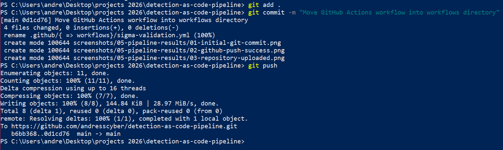

# Detection-as-Code Pipeline

## Overview

This project demonstrates a Detection-as-Code workflow using Sigma detection rules, Git version control, GitHub Actions, YAML linting, mock test telemetry, and automated CI/CD validation.

The repository simulates a modern Detection Engineering process where security detections are managed as code, tracked through version control, validated through automation, and continuously improved through structured security engineering workflows.

By treating detections as code, security teams can improve detection quality, reduce manual errors, enforce consistency, and create repeatable workflows before detections are deployed into SIEM or EDR platforms.

---

## Lab Objectives

- Develop Sigma-based security detections
- Implement Detection-as-Code methodology
- Use Git and GitHub for version control
- Automate detection validation with GitHub Actions
- Validate YAML formatting with yamllint
- Maintain mock telemetry for detection testing
- Map detection logic to MITRE ATT&CK
- Demonstrate CI/CD practices for security content

---

## Architecture

```text
                  [ Feature Branch ]
                          │
                          ▼
                 [ Local Sigma CLI ]
                     /         \
               (Fail)         (Pass)
                 │              │
                 ▼              ▼
            Fix Rule       Git Push
                               │
                               ▼
                    [ Pull Request ]
                               │
                               ▼
                [ GitHub Actions CI/CD ]
                     /             \
                (Fail)           (Pass)
                  │                │
                  ▼                ▼
            Block Merge      Merge Detection
                                    │
                                    ▼
                          Detection Deployment
```

---

## Technologies Used

| Technology | Purpose |
|---|---|
| Sigma | Detection rule development |
| Sigma CLI | Rule testing and validation |
| yamllint | YAML formatting validation |
| Git | Version control |
| GitHub | Source code management |
| GitHub Actions | CI/CD automation |
| YAML | Detection rule format |
| JSON | Mock test telemetry |
| MITRE ATT&CK | Threat technique mapping |

---

## Repository Structure

```text
detection-as-code-pipeline
│
├── .github
│   └── workflows
│       └── sigma-validation.yml
│
├── sigma-rules
│   └── suspicious-powershell.yml
│
├── tests
│   └── powershell-test-event.json
│
├── screenshots
│
└── README.md
```

---

## Sigma Detection Rule

The project includes a Sigma detection designed to identify suspicious PowerShell execution.

### Detection Logic

```yaml
Image|endswith: '\powershell.exe'

CommandLine|contains:
  - '-enc'
  - 'EncodedCommand'
  - 'IEX'
```

### Detection Focus

- Encoded PowerShell execution
- Suspicious command-line usage
- Script execution through PowerShell
- MITRE ATT&CK T1059.001

---

## Mock Test Telemetry

The `tests` directory includes a mock Windows process creation event used to represent suspicious encoded PowerShell execution.

```json
{
  "EventID": 4688,
  "Provider": "Microsoft-Windows-Security-Auditing",
  "Image": "C:\\Windows\\System32\\WindowsPowerShell\\v1.0\\powershell.exe",
  "CommandLine": "powershell.exe -NoProfile -ExecutionPolicy Bypass -enc SQBFAFgA",
  "ParentImage": "C:\\Windows\\explorer.exe",
  "User": "LAB\\testuser",
  "Host": "WIN10-ENDPOINT",
  "DetectionPurpose": "Mock telemetry used to test suspicious encoded PowerShell execution logic"
}
```

---

## GitHub Actions Workflow

The GitHub Actions pipeline automatically runs when Sigma rules, test telemetry, or workflow files are modified.

### CI/CD Validation Steps

- Checkout repository
- Install Python
- Install Sigma CLI and yamllint
- Display Sigma CLI version
- Validate YAML formatting
- List available test telemetry
- Validate Sigma rule repository contents

---

## Project Screenshots

### Environment Setup

#### Project Folder Structure


#### Python and Sigma Installation


#### Sigma CLI Verification


#### Git Installation


---

### Detection Development

#### Sigma Detection Rule


---

### Validation Testing

#### Sigma Validation Testing


#### Mock Test Telemetry


---

### GitHub Actions Configuration

#### Initial Workflow Configuration


#### YAML Linting Workflow Update


---

### Pipeline Results

#### Initial Git Commit


#### GitHub Push


#### Repository Upload


#### Workflow Directory Fix



#### GitHub Actions Workflow Detected


#### Successful Workflow Execution


#### Workflow Details


#### YAML Linting Workflow Run


#### YAML Linting Workflow Success


---

## MITRE ATT&CK Mapping

| Technique | Description |
|---|---|
| T1059.001 | PowerShell |
| T1027 | Obfuscated Files or Information |
| T1140 | Deobfuscate/Decode Files or Information |

---

## Skills Demonstrated

### Detection Engineering

- Sigma rule development
- Suspicious PowerShell detection
- Detection logic creation
- ATT&CK mapping
- Rule validation workflow

### DevSecOps

- Git version control
- GitHub repository management
- GitHub Actions CI/CD
- YAML linting
- Automated validation

### Security Operations

- PowerShell monitoring
- Process creation analysis
- Mock telemetry validation
- Detection lifecycle management

---

## Results

Successfully built a Detection-as-Code pipeline that:

- Stores detection rules in version control
- Uses Sigma for portable detection logic
- Uses mock telemetry for detection testing context
- Runs GitHub Actions on detection updates
- Validates YAML formatting with yamllint
- Demonstrates CI/CD practices for security detections
- Maps detection logic to MITRE ATT&CK

---

## Future Enhancements

- Add additional Sigma detections
- Add Splunk SPL conversion
- Add Microsoft Sentinel KQL conversion
- Add pull request branch protection
- Add automated detection test cases
- Add detection coverage reporting
- Integrate with SIEM deployment workflows

---

## Resume Bullet

> Designed and implemented a Detection-as-Code pipeline using Git, Sigma, yamllint, and GitHub Actions to automate validation of security detections, enforce MITRE ATT&CK alignment, and apply CI/CD practices to detection engineering workflows.
