# Detection-as-Code Pipeline

## Overview

This project demonstrates a Detection-as-Code (DaC) workflow using Sigma detection rules, Git version control, GitHub Actions, YAML linting, mock telemetry, and automated CI/CD validation.

The repository simulates a modern Detection Engineering process where security detections are managed as code, tracked through version control, automatically validated through CI/CD pipelines, and converted into platform-specific detections for security monitoring solutions.

By treating detections as code, organizations can improve detection quality, reduce deployment errors, enforce consistency, and automate validation before deployment into production SIEM or EDR environments.

---

## Lab Objectives

- Develop Sigma-based security detections
- Implement Detection-as-Code methodology
- Use Git and GitHub for version control
- Automate detection validation using GitHub Actions
- Validate YAML formatting with yamllint
- Maintain mock telemetry for detection testing
- Convert Sigma detections into SIEM-specific queries
- Map detections to the MITRE ATT&CK framework
- Demonstrate CI/CD practices for detection engineering

---

## Architecture

```text
                  [ Feature Branch ]
                          │
                          ▼
                 [ Local Sigma CLI ]
                     /         \
               (Fail)         (Pass)
                 │              │
                 ▼              ▼
            Fix Rule       Git Push
                               │
                               ▼
                    [ Pull Request ]
                               │
                               ▼
                [ GitHub Actions CI/CD ]
                     /             \
                (Fail)           (Pass)
                  │                │
                  ▼                ▼
            Block Merge      Merge Detection
                                    │
                                    ▼
                          Detection Deployment
```

---

## Technologies Used

| Technology | Purpose |
|------------|----------|
| Sigma | Detection rule development |
| Sigma CLI | Rule validation |
| yamllint | YAML validation |
| Git | Version control |
| GitHub | Source code management |
| GitHub Actions | CI/CD automation |
| YAML | Detection rule format |
| JSON | Test telemetry |
| Splunk SPL | Detection conversion |
| Microsoft Sentinel KQL | Detection conversion |
| MITRE ATT&CK | Threat mapping |

---

## Repository Structure

```text
detection-as-code-pipeline
│
├── .github
│   └── workflows
│       └── sigma-validation.yml
│
├── sigma-rules
│   └── suspicious-powershell.yml
│
├── tests
│   └── powershell-test-event.json
│
├── dist
│   ├── splunk-suspicious-powershell.spl
│   └── sentinel-suspicious-powershell.kql
│
├── screenshots
│
└── README.md
```

---

## Sigma Detection Rule

The project includes a Sigma detection designed to identify suspicious PowerShell execution activity.

### Detection Logic

```yaml
Image|endswith: '\powershell.exe'

CommandLine|contains:
  - '-enc'
  - 'EncodedCommand'
  - 'IEX'
```

### Detection Focus

- Encoded PowerShell execution
- Obfuscated command execution
- In-memory script execution
- MITRE ATT&CK T1059.001

---

## Mock Test Telemetry

The `tests` directory contains mock Windows process creation telemetry used to represent suspicious encoded PowerShell execution activity.

```json
{
  "EventID": 4688,
  "Provider": "Microsoft-Windows-Security-Auditing",
  "Image": "C:\\Windows\\System32\\WindowsPowerShell\\v1.0\\powershell.exe",
  "CommandLine": "powershell.exe -NoProfile -ExecutionPolicy Bypass -enc SQBFAFgA",
  "ParentImage": "C:\\Windows\\explorer.exe",
  "User": "LAB\\testuser",
  "Host": "WIN10-ENDPOINT"
}
```

---

## Detection Portability

One of Sigma's primary advantages is the ability to create platform-agnostic detections.

To demonstrate portability, the Sigma rule was converted into equivalent queries for multiple SIEM platforms.

### Splunk SPL

```spl
index=windows sourcetype=XmlWinEventLog:Microsoft-Windows-Sysmon/Operational
Image="*\\powershell.exe"
(CommandLine="*-enc*" OR CommandLine="*EncodedCommand*" OR CommandLine="*IEX*")
```

### Microsoft Sentinel KQL

```kql
DeviceProcessEvents
| where FileName =~ "powershell.exe"
| where ProcessCommandLine has_any ("-enc", "EncodedCommand", "IEX")
```

### Converted Query Examples

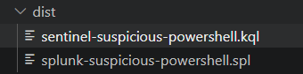

---

## GitHub Actions Workflow

The GitHub Actions workflow automatically executes when Sigma rules, test telemetry, or workflow files are modified.

### CI/CD Validation Tasks

- Checkout repository
- Install Python
- Install Sigma CLI
- Install yamllint
- Validate YAML formatting
- Validate Sigma rule repository
- Verify test telemetry availability

### Workflow Process

```text
Sigma Rule Modified
        │
        ▼
Git Commit
        │
        ▼
Git Push
        │
        ▼
GitHub Actions Triggered
        │
        ▼
YAML Validation
        │
        ▼
Sigma Validation
        │
        ▼
Workflow Result
```

---

## Project Screenshots

### Environment Setup

#### Project Folder Structure

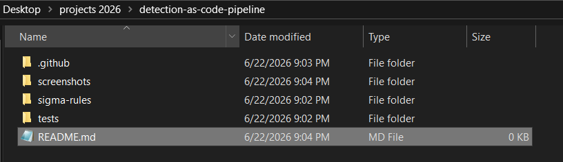

#### Python and Sigma Installation

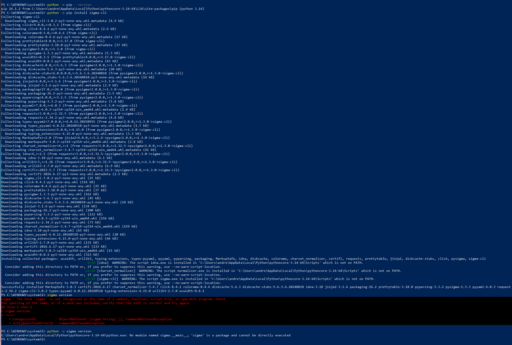

#### Sigma CLI Verification

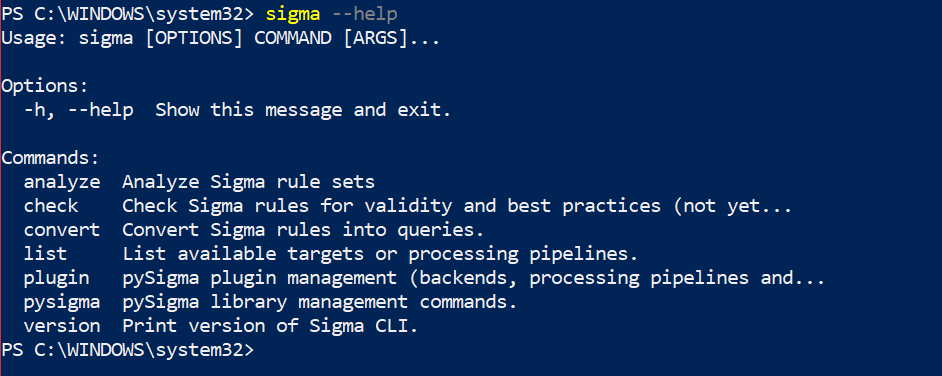

#### Git Installation

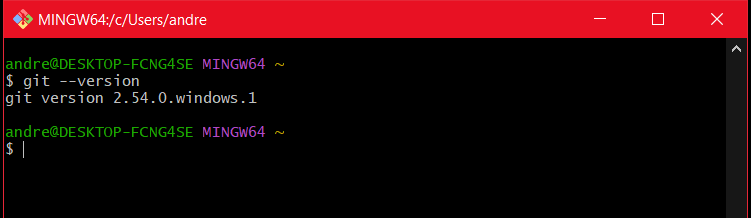

---

### Detection Development

#### Sigma Detection Rule

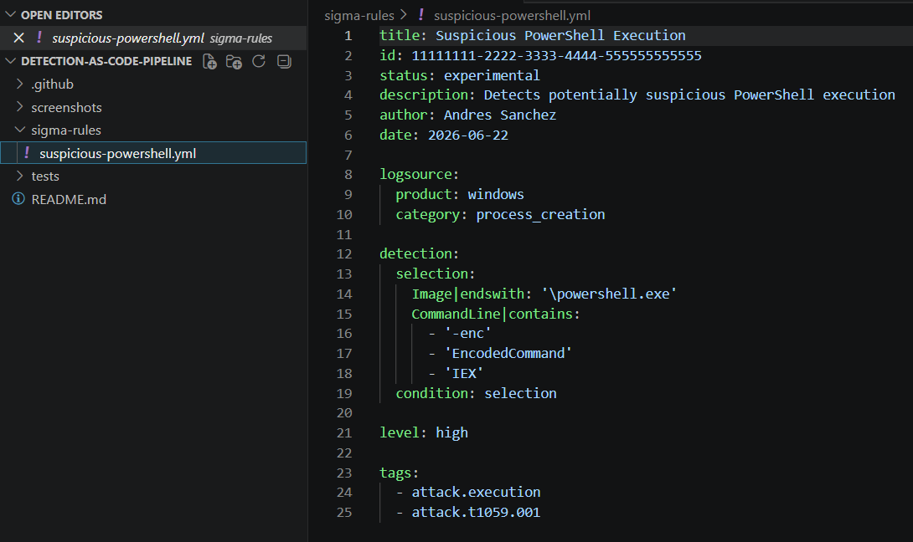

---

### Validation Testing

#### Sigma Validation Testing

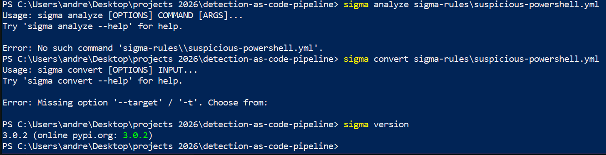

#### Mock Test Telemetry

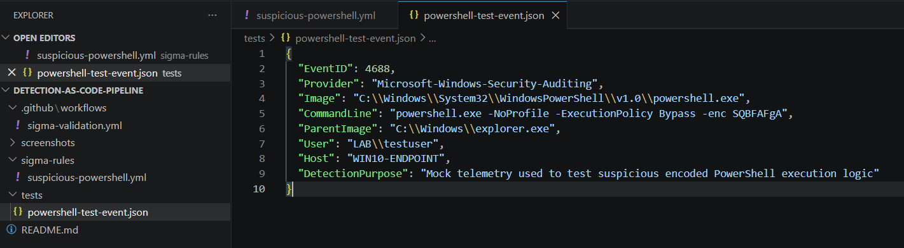

---

### GitHub Actions Configuration

#### GitHub Actions Workflow

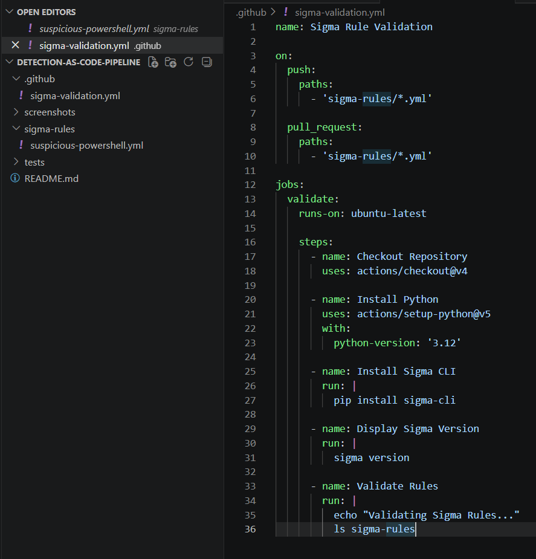

#### YAML Linting Update

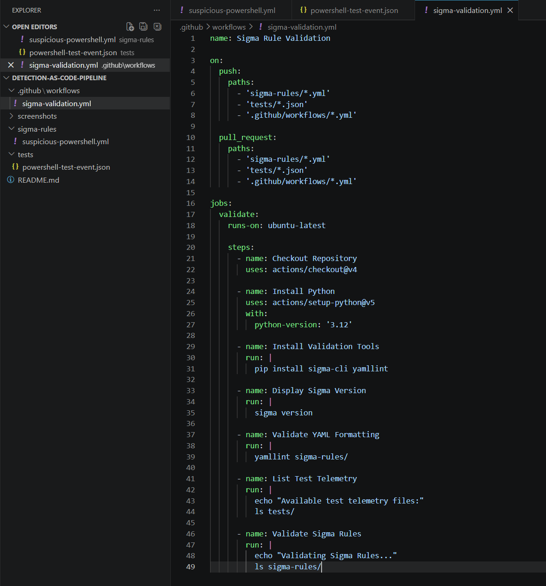

---

### Pipeline Results

#### Initial Git Commit

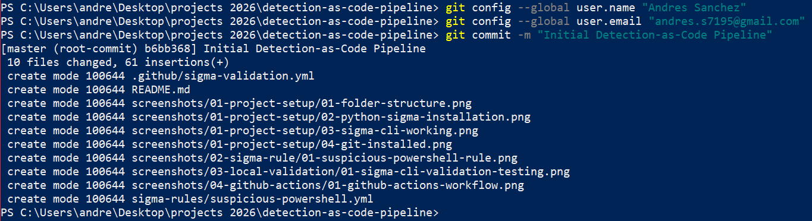

#### GitHub Push

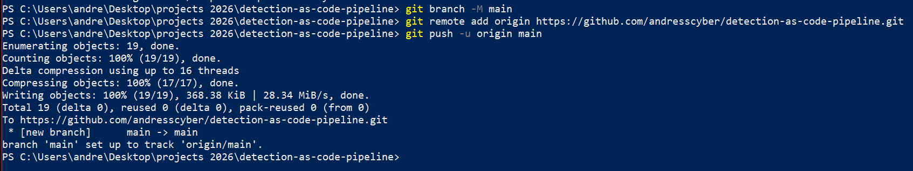

#### Repository Upload

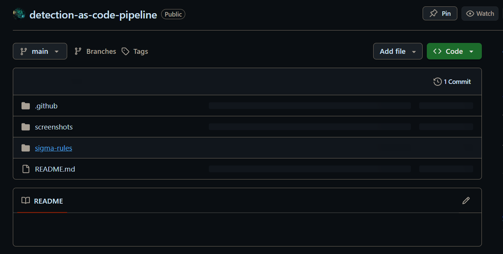

#### GitHub Actions Workflow Detection

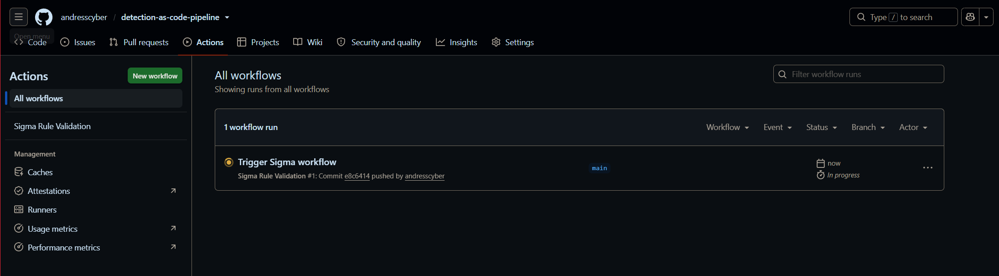

#### Successful Workflow Execution

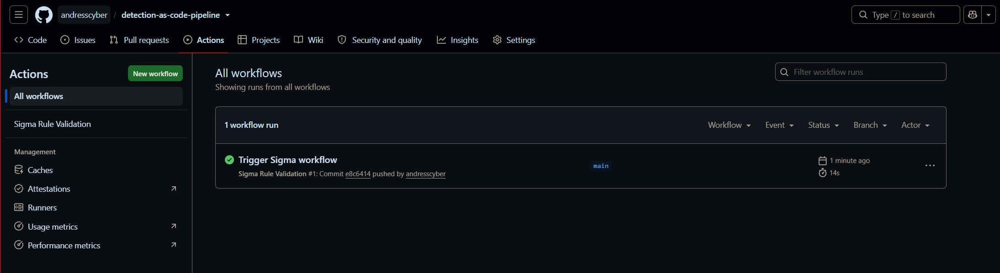

#### Workflow Details

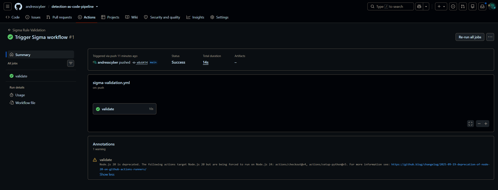

---

## MITRE ATT&CK Mapping

| Technique | Description |
|------------|-------------|
| T1059.001 | PowerShell |
| T1027 | Obfuscated Files or Information |
| T1140 | Deobfuscate/Decode Files or Information |

---

## Skills Demonstrated

### Detection Engineering

- Sigma Rule Development
- Detection-as-Code
- ATT&CK Mapping
- Detection Validation
- Detection Portability

### DevSecOps

- Git
- GitHub
- GitHub Actions
- CI/CD Pipelines
- YAML Validation

### Security Operations

- PowerShell Detection
- Threat Detection
- Process Creation Analysis
- Mock Telemetry Testing

---

## Results

Successfully developed a Detection-as-Code pipeline capable of:

- Managing security detections through version control
- Automating validation through GitHub Actions
- Enforcing YAML quality standards with yamllint
- Maintaining test telemetry for validation workflows
- Converting Sigma detections into Splunk and Sentinel queries
- Demonstrating CI/CD practices used by Detection Engineering teams

---

## Future Enhancements

- Additional Sigma detections
- Automated Sigma linting
- Detection coverage reporting
- Pull request approval workflows
- Splunk deployment integration
- Microsoft Sentinel deployment integration
- Automated detection testing

---

## Resume Bullet

> Designed and implemented a Detection-as-Code pipeline using Git, Sigma, yamllint, and GitHub Actions to automate validation of security detections, enforce MITRE ATT&CK alignment, and apply CI/CD practices to modern detection engineering workflows.